# The Scoop

A is a vibrant and community-driven platform that immerses visitors in the sweet world of ice cream, celebrating the very best frozen treats across Ireland. Whether you're a dedicated ice cream aficionado or a curious adventurer, this website is your ultimate destination for discovering hidden gems, iconic parlors, and the most unique, mouth-watering scoops the country has to offer. With a sleek, user-friendly design and intuitive navigation, The Scoop makes it effortless to explore, interact, and share in the fun. Featuring detailed reviews, vibrant imagery, and a rich, engaging aesthetic, it's a one-stop hub for all things ice cream, sparking excitement for those eager to embark on a delicious journey, scoop by scoop.

Live Link: https://the-scoop-670ac5b1567b.herokuapp.com/

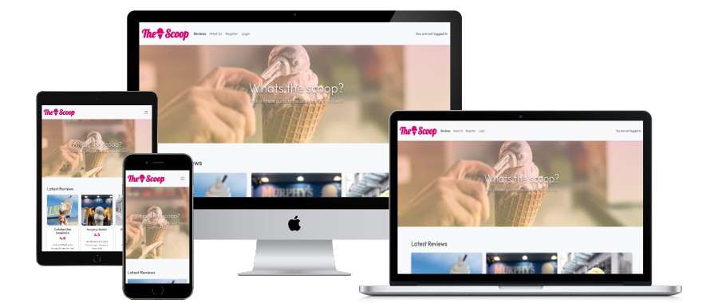


## Overview

The Scoop provides an easy and engaging way to explore, share, and manage ice cream experiences. With a focus on user interaction, the site offers several CRUD functionalities, allowing visitors to Create, Read, Update, and Delete content as part of a dynamic, community-driven platform. The website is designed with a mobile-first approach, ensuring that it adapts seamlessly across different screen sizes, from desktop to mobile devices. Built using Bootstrap 5 for responsive grids, flexible layouts, and ease of customization.


## Features

__Existing features:__
 
- **Homepage with Ice Cream Reviews:**

  - Main Section:
    - The homepage serves as the primary destination for new visitors, showcasing ice cream reviews in a clean, organized layout.

    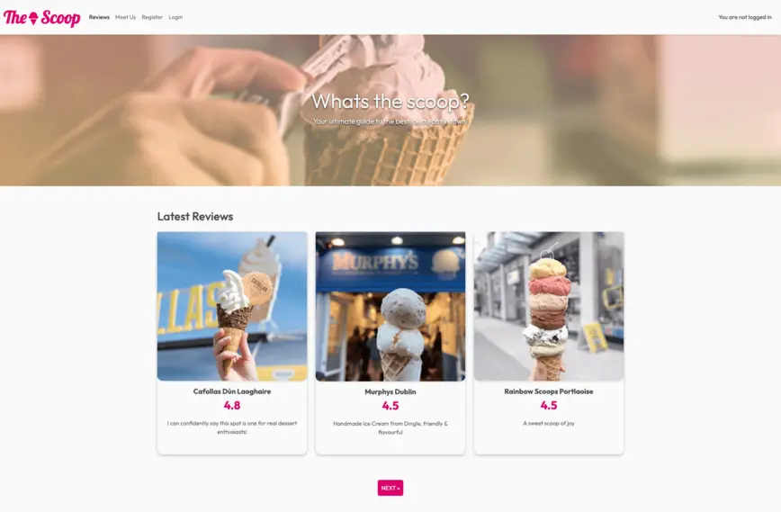

  - Navigation:
    - A sticky top navigation bar allows users to easily navigate through various sections of the site including Reviews, Meet the Team, and Account-related features such as Registration and Login.

     | 

  - Review Blurbs:
    - Each review card provides users with concise, engaging snippets about different ice cream parlors, complete with ratings, descriptions, and images to entice users to read more.

    

- **User Account System:**

  - Sign-Up & Login: 
    - Users can create an account, log in, and track their favorite reviews, making the experience personalized. The system supports basic user authentication (using Django’s authentication features).

    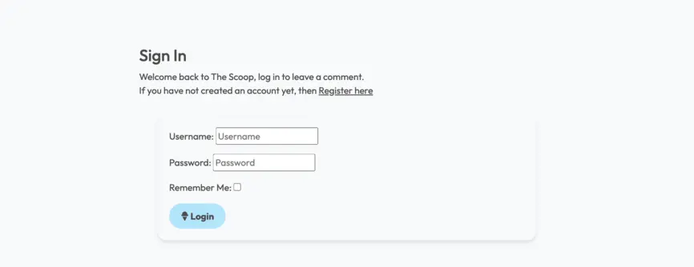  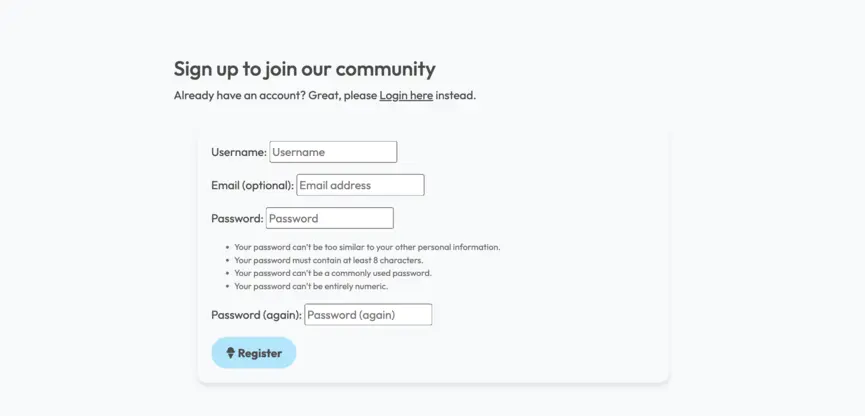

- **Interactive Review Pages:**

  - Detailed Reviews: 
    - Each location review page contains in-depth content, including:
      - Ratings and personalized comments created by approved admin contributors.
      - Linked direction with Google Maps integration, to easily find each ice cream parlor’s location.
      - High-quality images and photos of the featured ice cream parlors and products.

    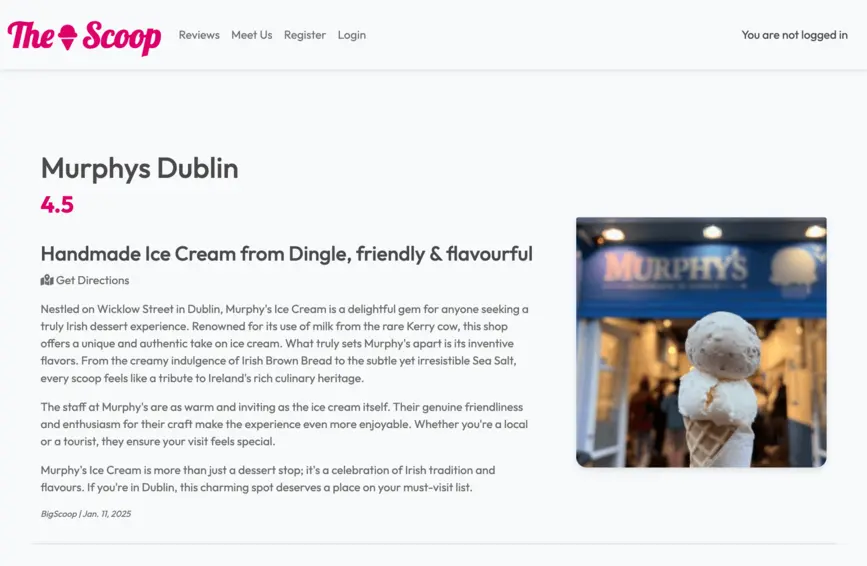

  - Commenting on Review Posts: 
    - Upon login, users can view and contribute by posting comments on each review page, fostering community interaction. 
      - Comments are displayed with the user’s name and timestamp.
    - Comments are always submitted for approval by an admin, making sure all members adhere to basic community guidelines.

    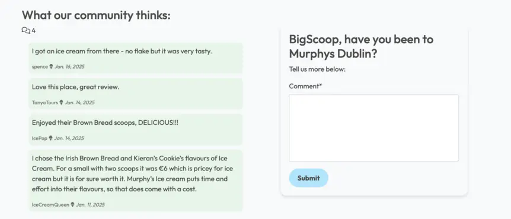 

- **Comments System (CRUD):**

  - Users can submit, view, and edit their comments. 
    - These comments contribute to building a community-driven platform where opinions and suggestions about ice cream spots are shared.
  
  - A CRUD functionality allows users to leave comments, which entails:
    - **Create** a new comment on a review page (upon login).
    - **Read** all existing comments, allowing users to engage with past opinions.
    - **Update** their own comments if they wish to modify them.
    - **Delete** their comments if needed.

    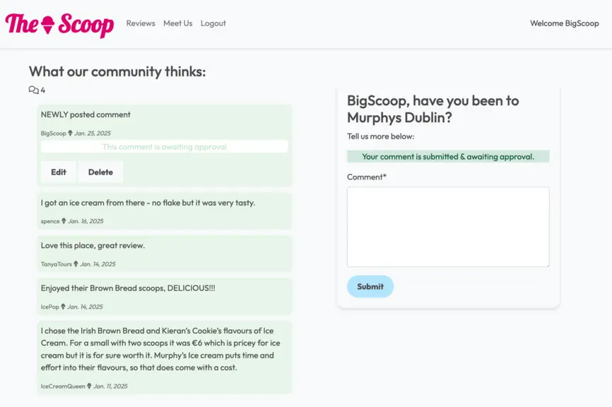 | 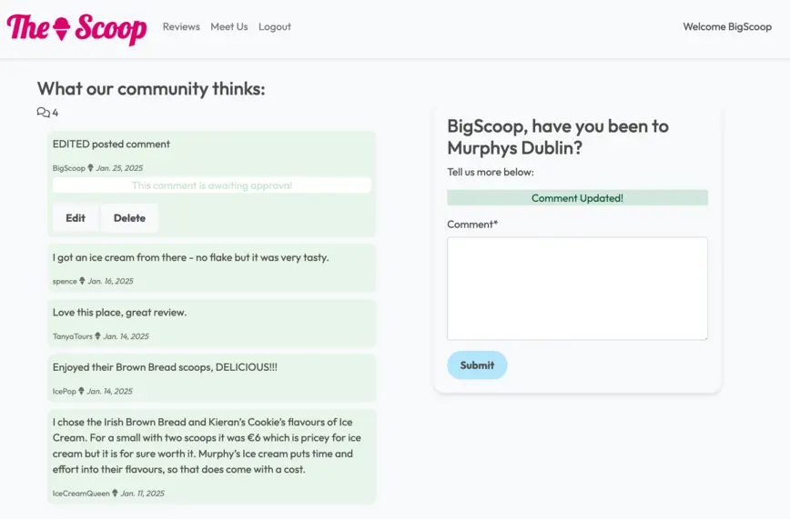 | 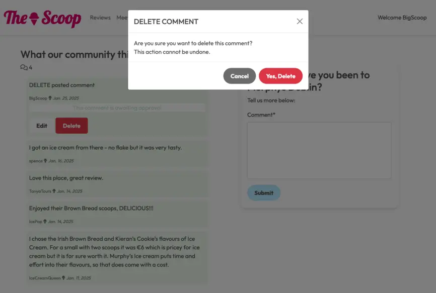

- **Contact and Suggestion Form:**

  - User Engagement:
    - A contact form allows users to submit suggestions for new ice cream spots they’d like to see reviewed. 
    - This form gathers user information via fields ie. name, email, and message.

  - CSRF Protection: 
    - Forms are protected using Django’s CSRF (Cross-Site Request Forgery) token to ensure security.

  - Backend Integration: 
    - The form submissions are stored in the backend for review by the website administrators.

  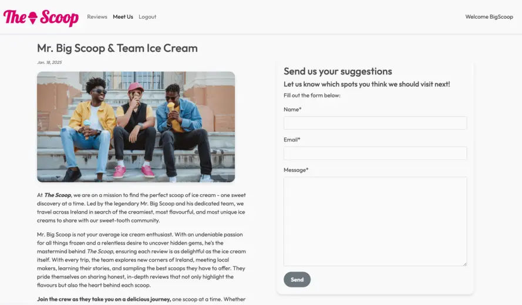

- **Social Media Integration:**

  - The website provides quick access to the brand’s social media profiles (Instagram and Twitter). 
    - Allowing users to follow along on their ice cream journey and stay updated on new reviews and content.

  - Social media icons are placed prominently in the footer to maintain easy access.

   

- **Admin Panel:**

  - As a developer, you'll be able to leverage Django’s built-in Admin Interface to easily manage content such as ice cream reviews, user comments, and form submissions.
  - Admin users can view, approve, or delete as needed to maintain site integrity.

   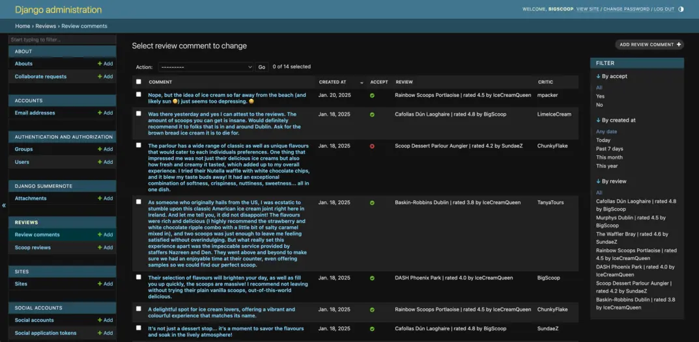


__Future Features__

- **Review Posts:**

  - Existing Reviews:
    - Upon login, users can upvote and downvote exisitng reviews added by approved contributors.

  - Personalized Reviews:
   - Upon login, users can contribute to the website by submitting their own ice cream reviews and adding ratings.

  - Social Gallery
    - Connecting Instagram post gallery to site, for more visual appeal.


## User Stories

User stories were used to keep track of the MOSCOW framework and project MVP as working through the project. 

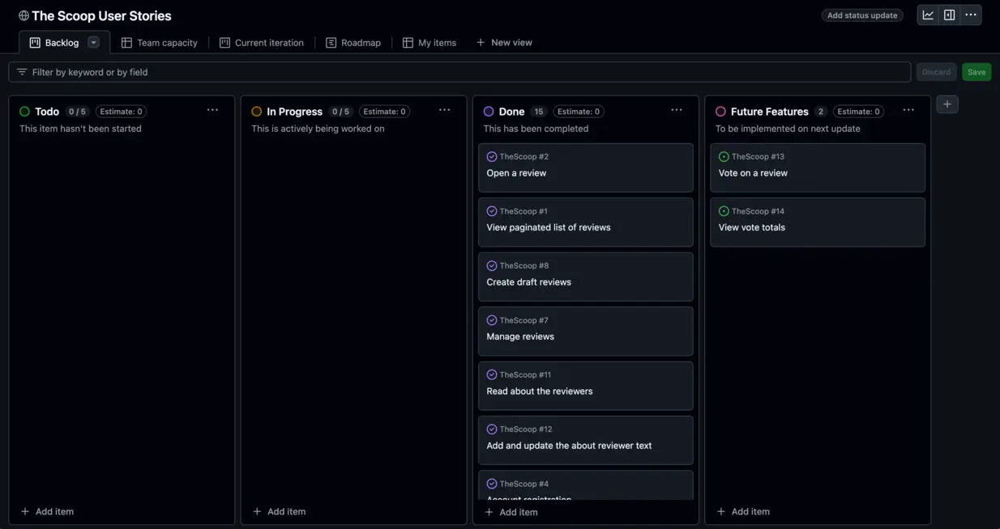

| USER STORY | DETAILS | ACCEPTANCE CRITERIA |
|---|---|---|
| **Open a review** | As a Site User, I can click on a review so that I can read the full text | (1) When a review title is clicked on, a detailed view of the review is seen. |
| **View paginated list of reviews** | As a Site User, I can view a paginated list of reviews so that I can select which review I want to view. | (1) Given more than one review in the database, these multiple reviews are listed. (2) When a user opens the main page a list of reviews is seen. (3) Then the user sees all review titles with pagination to choose what to read. |
| **Create draft reviews** | As a Site Admin I can create draft reviews so that I can finish writing the content later | (1) Given a logged in user, they can save a draft review. (2) Then they can finish the content at a later time. |
| **Manage reviews** | As a Site Admin I can create, read, update and delete reviews so that I can manage my site content | (1) Given a logged in user, they can create a review. (2) Given a logged in user, they can read a review. (3) Given a logged in user, they can update a review. (4) Given a logged in user, they can delete a review. |
| **Read about the reviewers** | As a Site User I can click on the Meet Us link so that I can learn more about reviewers | When the Meet Us link is clicked, the about reviewers text is visible |
| **Add and update the about reviewer text** | As a Site Admin I can create or update the Meet Us page content so that it is always up to date on the site. | (1) The About app is visible in the admin panel |
| **Account registration** | As a Site User I can register an account so that I can comment on a review | (1) Given an email, a user can register an account. (2) Then the user can log in. (3) When the user is logged in they can comment on existing reviews. |
| **View comments** | As a Site User / Admin I can view comments on an individual review so that I can read the conversation | (1) Given one or more user comments the admin can view them. (2) Then a site user can click on the comment thread to read the conversation. |
| **Comment on a review** | As a Site User I can leave comments on a review so that I can be involved in the conversation | (1) When a user comment is approved. (2) Then a user can reply. (3) Given more than one comment then there is a conversation thread. |
| **Approve comments** | As a Site Admin I can approve or disapprove comments so that I can filter out objectionable comments | (1) Given a logged in user, they can approve a comment. (2) Given a logged in user, they can disapprove a comment. |
| **Contact form** | As a Potential Collaborator I can fill in a contact form so that I can submit a request for collaboration | (1) Potential Collaborator visiting site can submit request |
| **Store contact form requests** | As a Site User I can store collaboration requests in the database so that I can review them | (1) View contact form requests (2) Mark collaboration requests as read. (3) See how many requests to still process |
| **Modify or delete comment on a review** | As a Site User I can modify or delete my comment on a review so that I can be involved in the conversation | (1) Given a logged in user, they can modify their comment. (2) Given a logged in user, they can delete their comment. |
| **Add image to review** | As a Site Admin I can add an image to review so that each post will give a visual detail| (1) Given a logged in user, they can add an image to a review. |
| **Add directions map to review** | As a Site Admin I can add a directions URL so that location of place reviewed is accessible via map | (1) Given a logged in user, they can add a directions URL to a review. |
| **Vote on a review** | As a Site User I can leave an upvote or downvote on a review so that I can give my opinion on the review | (1) When a user likes the review they click upvote icon. (2) When a user doesn't agree with review they click downvote icon |
| **View vote totals** | As a Site User / Admin I can view votes on an individual review so that I can see what users think of review | (1) Given one or more user votes the totals are visible below review post. |


## Agile

For the Agile process I utilised the Github project board and user stories. Detailing the production process and highlighting issues when they arose. 

### Project Issues


New user stories have been added as the project progressed and based on user feedback during the final testing phase. 

A MOSCOW framework has been utilised. 

**Mo:** Full review details, CRUD functionality.(Leave reviews, edit reviews, delete reviews) \
**S:** Ratings that are shown on all pages and averaged.  \
**C:** Code and style revisement. Future features such as Carousel view, ratings convered to star ratings. 
**oW:** Ability to add own reviews as a user. 

## Solution Model

- **Home Page:**
  - The starting point, with access to various functionalities like browsing reviews, logging in, or account registration.
    - Login: Users can log in to an existing account to leave comments.
    - Register: Users can Sign Up and create a new account to leave comments.
  - Browse Reviews:
    - Users can explore various ice cream reviews, sorted by location or rating.

- **Review Post Page:**
  - Upon selecting a review, users can view detailed content, such as descriptions, location(if provided), ratings, and images.
  - Post Comment: 
    - Users can engage with the content by leaving comments on individual reviews (after logging in).
    - A part of the login/register process, allowing new users to sign up and access comment form from review post page.

- **Meet Us**
  - Team bio and image to have more information available to user on reviewers.
  - Submit Suggestion: Any visitor to site can send suggestions for ice cream locations to be reviewed.

- **Admin Panel:**
  - Admins can manage content, view all comments, and moderate them.
    - View Comments: Admins can view user comments on reviews for approval.
    - Edit/Delete Comment: Admins have the ability to moderate and manage comments, ensuring a positive and relevant community experience.

### Flowchart


## UX/UI Wireframing

- **Design and Aesthetic:**
  - The site uses Bootstrap 5, ensuring responsiveness across devices.
  - A custom CSS file applies additional styling, creating a clean, vibrant look that reflects the fun, indulgent theme of ice cream.
  - The background and typography choices emphasize a fun, welcoming atmosphere.

- **Branding and Navigation:**
  - The website features a playful branding style, combining the fonts "Outfit" and "Lobster" with an ice cream icon in its logo.
  - The navigation bar is straightforward and accessible, featuring links to:
    - Reviews: Likely showcasing detailed evaluations of ice cream spots.
    - Meet Us: Introducing the team and their mission.
    - Register/Login: Allowing users to create accounts or log in for a more personalized experience.
  - The navbar is responsive, collapsing into a toggler for mobile users.

- **Mission and Team Bio:**
  - The About section highlights the team’s mission.
  - The bio is accompanied by an image, emphasizing a personal and relatable connection with the audience.

- **User Interaction:**
  - Any visitor can submit suggestions for new ice cream spots through an embedded form. The form includes:
    - Name, Email and Message fields
  - This invites active participation and fosters community engagement.

- **Social Media Integration:**
  - The footer encourages users to follow the team’s journey on Instagram and Twitter, using Font Awesome icons for a modern touch.
  - These links make it easy for fans to stay updated and interact with the brand on social platforms.

### Wireframe

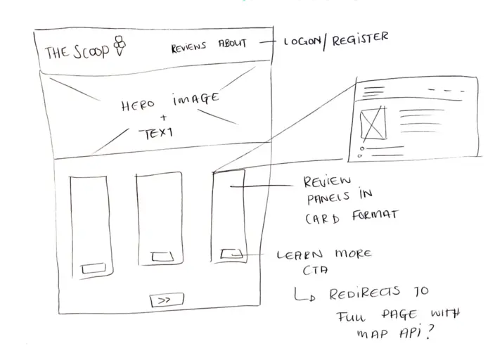

### ERD Design

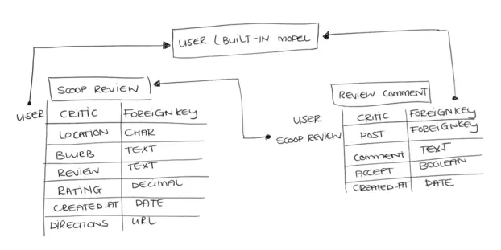

### Database Model

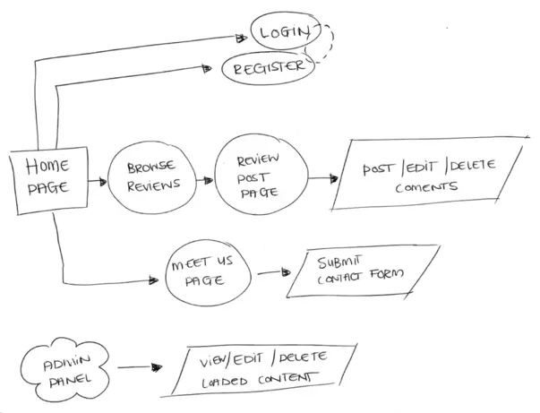

## Site Testing 
Please see [TESTING.md](TESTING.md) document.

## Technologies Used

### Languages

__Application Structure__

- **Frontend:**
  - HTML5/CSS3: Provides structure and styling for reviews and user interactions.
  - Bootstrap: Responsive design for easy navigation on various screen sizes.
  - JavaScript: Enhances interactivity (dynamically toggling comments visibility).

- **Backend:**
  - Django Framework (Python): Handles routing, user authentication etc.

### Libraries & Frameworks

- Django v4.2.17
- Django AllAuth v0.57.2
- Django Crispy Forms v2.0
- Crispy Bootstrap5 v.7
- Django Summernote v0.8.2
- Cloudinary v1.36.0
- Python v3.13.0

### Other Sites

- Responsive Screen Preview
  - MockUp Generator: https://websitemockupgenerator.com/

- Images downloaded under licenced user
  - Adobe Stock: https://stock.adobe.com/

- Turning FontAwesome icon into sized favicons:
  - Favicon: https://favicon.io/

- Contrast checker for accessibility:
  - Webaim: https://webaim.org/
    
- Image assets reduced with online platforms:
  - TinyPNG: https://tinypng.com/
  - XConvert: https://www.xconvert.com/
  - Reduce Images: https://www.reduceimages.com/

- Assisted problem solving sites:
  - https://forums.knack.com/
  - https://docs.djangoproject.com/
  - https://developer.mozilla.org/
  - https://stackoverflow.com/
  - https://www.w3schools.com/
  - https://www.geeksforgeeks.org/


## Django Project Setup

1. Install Django and supporting libraries: 
   
- ```pip3 install 'django<4' gunicorn```
- ```pip3 install dj_database_url psycopg2```
- ```pip3 install dj3-cloudinary-storage```  
  
2. Once you have installed any relevant dependencies or libraries, such as the ones listed above, it is important to create a **requirements.txt** file and add all installed libraries to it with the ```pip3 freeze --local > requirements.txt``` command in the terminal.  
3. Create a new Django project in the terminal ```django-admin startproject thescoop .```
4. Create a new app eg. ```python3 mangage.py startapp booking```
5. Add this to list of **INSTALLED_APPS** in **settings.py** - 'reviews',
6. Create a superuser for the project to allow Admin access and enter credentials: ```python3 manage.py createsuperuser```
7. Migrate the changes with commands: ```python3 manage.py migrate```
8. An **env.py** file must be created to store all protected data such as the **DATABASE_URL** and **SECRET_KEY**. These may be called upon in your project's **settings.py** file along with your Database configurations. The **env.py** file must be added to your **gitignore** file so that your important, protected information is not pushed to public viewing on GitHub. For adding to **env.py**:

- ```import os```
- ```os.environ["DATABASE_URL"]="<copiedURLfromPostgresSQL>"```
- ```os.environ["SECRET_KEY"]="my_super^secret@key"```
  
For adding to **settings.py**:

- ```import os```
- ```import dj_database_url```
- ```if os.path.exists("env.py"):```
- ```import env```
- ```SECRET_KEY = os.environ.get('SECRET_KEY')``` (actual key hidden within env.py)  

9. Replace **DATABASES** with:

```
DATABASES = {
    'default': dj_database_url.parse(os.environ.get("DATABASE_URL"))
  }
```

10. Set up the templates directory in **settings.py**:
- Under ``BASE_DIR`` enter ``TEMPLATES_DIR = os.path.join(BASE_DIR, ‘templates’)``
- Update ``TEMPLATES = 'DIRS': [TEMPLATES_DIR]`` with:

```
os.path.join(BASE_DIR, 'templates'),
os.path.join(BASE_DIR, 'templates', 'allauth')
```

- Create the media, static and templates directories in top level of project file in IDE workspace.

11. A **Procfile** must be created within the project repo for Heroku deployment with the following placed within it: ```web: gunicorn thescoop.wsgi```
12. Make the necessary migrations again.

## Cloudinary API 

Cloudinary provides a cloud hosting solution for media storage. All users uploaded images in the FreeFid project are hosted here.

Set up a new account at [Cloudinary](https://cloudinary.com/) and add your Cloudinary API environment variable to your **env.py** and Heroku Config Vars.
In your project workspace: 

- Add Cloudinary libraries to INSTALLED_APPS in settings.py 
- In the order: 
```
   'cloudinary_storage',  
   'django.contrib.staticfiles',  
   'cloudinary',
```
- Add to **env.py** and link up with **settings.py**: ```os.environ["CLOUDINARY_URL"]="cloudinary://...."``` 
- Set Cloudinary as storage for media and static files in settings.py:
- ```STATIC_URL = '/static/'```
```
  STATICFILES_STORAGE = 'cloudinary_storage.storage.StaticHashedCloudinaryStorage'  
  STATICFILES_DIRS = [os.path.join(BASE_DIR, 'static'), ]  
  STATIC_ROOT = os.path.join(BASE_DIR, 'staticfiles')‌  
  MEDIA_URL = '/media/'  
  DEFAULT_FILE_STORAGE = 'cloudinary_storage.storage.MediaCloudinaryStorage'
```

## Postgres SQL

A new database instance can be created on [Postgres SQL](https://www.postgresql.org/) for your project. 

- From your user dashboard, retrieve the important 'postgres://....' value. Place the value within your **DATABASE_URL**  in your **env.py** file and follow the below instructions to place it in your Heroku Config Vars.


## Deployment

### Cloning of the Repository Code locally
- The terminal function and template for the deployable application was provided by Code Institute
  - Go to the Github repository that you want to clone
  - Click on the Code button located above all the project files
  - Click on HTTPS and copy the repository link
  - Open the IDE of your choice and paste the copied git url into the IDE terminal
  - The project is now created as a local clone

| **Step** | **Code** | 
|---|---|
| **In Github** |
| Create a new Github Repo | Github > new Repository |
| Open Repo | If your Github is utlising the plugin click 'Open' to launch your preferred IDE |
| **In IDE**|
| Install Django: | pip3 install Django~=4.2.1 |
| Create requirements file | pip3 --local > requirements.txt |
| Create Project (proj_name)| Django-admin startproject proj_name . |
| Run Server | python3 manage.py runserver |
| Add Servers to ALLOWED_HOSTS in settings.py | ALLOWED_HOSTS = ALLOWED_HOSTS = ['.codeinstitute-ide.net', '.herokuapp.com'] |
| Create App (app_name) | python3 manage.py startapp app_name |
| Add to INSTALL_APPS in settings.py | INSTALLED_APPS = [… 'app_name',] |
| **Set Up Heroku** |
| Heroku Dashboard | https://www.heroku.com/ |
| Create new Heroku App | Choose unique name / select close region |
| Add Config Vars | Config Vars > Reveal Config Vars > Add New Key > DISABLE_COLLECTSTATIC value 1 |
| **In IDE** |
| Install web server Gunicorn and freeze | pip3 install gunicorn~=20.1 \ pip3 freeze --local>requirements.txt |
| Create Procfile | create Procfile in root directory |
| Declare Procfile | Add web : gunicorn proj_name.wsgi in Procfile |
| **In Heroku** |
| Connect Repository | Navigate to Deploy tab > connect to Github Repo |
| Check Add ons & Dynos | Inside app resources make sure to use Eco Dynos. Delete PostGres DB Add-ons |
| **Database** |
| Create Postgres Database | CI Database Creator - https://dbs.ci-dbs.net/ |
| **In IDE** |
| Install Database Packages | pip3 install dj-database-url~=0.5 psycopg / then pip3 freeze --local > requirements.txt |
| Create env.py file | Root directoy add env.py and add to .gitignore |
| **In env.py** |
| import OS | Top line 'import os' |
| set enviroment variables | os.environ["DATABASE_URL"] = "Paste in PostgreSQL database URL" |
| Secret Key | os.environ["SECRET_KEY"] = "Make up your own randomSecretKey" |
| **In Heroku** | 
| Add Secret Ket to config Vars |  SECRET_KEY, “randomSecretKey” |
| Add a Config Var called DATABASE_URL | DATABASE_URL, “yourDBUrlgoeshere” |
| **In settings.py** |
| Link to env.py | from pathlib import Path, import os, import dj_database_url, if os.path.isfile("env.py"): import env |
| Remove secret key | SECRET_KEY = os.environ.get('SECRET_KEY') |
| Comment out old Database section | # DATABASES = { } ( # on each line ) |
| Add new Databases section | DATABASES = {'default': dj_database_url.parse(os.environ.get("DATABASE_URL"))} |
| **Migrate Database** |
| Save all files and Migrate | python3 manage.py migrate |
| **Create Super User** |
| Create Super User | python3 manage.py createsuperuser |
| **In settings.py** |
| Set DEBUG to false | DEBUG = False |
|**Redeploy** |
| Push all Git changes and commits | Redeploy to Heroku |

### Version Control
- The Scoop was created using Gitpod editor and pushed to Github to the remote repository 'TheScoop'
- Git commands were used throughout the development to push the code to the remote repository
- The following git commands were used:
  - git add .  to add the files to the staging area before being committed
  - git commit -m "commit message", to commit changes to the local repository queue that are ready for the final step
  - git push, to push all committed code to the remote repository on Github
  - pip3 install imports, for python library loads
  - add loaded packages to requirements.txt file for Heroku:
    - run, pip3 freeze > requirements.txt, to terminal

## Credits 

- Stock Images (licenced):
  - Main Header: https://stock.adobe.com/ie/images/putting-ice-cream-to-cone-summer-concept/167207995
  - Error Page Header: https://stock.adobe.com/ie/images/a-melted-ice-cream-cone-with-drips-and-stains-accident-cone/1172861928
  - Default Cone Image: Cloudinary Stock Library 
    - https://asset.cloudinary.com/dcaygv4vw/16aa550b58d759f1cd894bc2993d80a1

- Ice Cream Parlour Info & Images:
  - https://www.cafollasicecreamandcoffee.ie/ 
  - https://murphysicecream.ie/
  - https://www.instagram.com/rainbow_scoops/?hl=en
  - https://www.instagram.com/dashcafe_/?hl=en
  - https://www.scoopgelato.ie/
  - https://www.instagram.com/baskinrobbinsireland/

- My mentor for the support and knowledge shared.
- Slack channel peers for their feedback and support with errors.
- Tutor Assist for the support when debugging became overwhelming