# Testing

Testing file for The Scoop [README.md](README.md).

## Testing User Stories

### Developer Stories

- [x] Frontend and Backend of the project created.
- [x] Database is connected to the project.
- [x] App deployed on Heroku.

### User Stories

- [x] Open a review
- [x] View paginated list of reviews
- [x] Create draft reviews
- [x] Manage reviews
- [x] Read about the reviewers
- [x] Add and update the about reviewer text
- [x] Account registration
- [x] View comments
- [x] Comment on a review
- [x] Approve comments
- [x] Contact form
- [x] Store contact form requests
- [x] Modify or delete comment on a review
- [x] Add image to review
- [x] Add directions map to review

## Validation

### Validation Errors
- About page `img` tag not correctly formatted:
    - Define new class to `styles.css` for best practice

- Modify all nav-link DTL tags: 
    - Adjusted  to include aria-current and appear on rendered page

- Fix page referencing
    - Fix self contained content & conditional statements for best semantic representation

- Summernote auto adds paragraphs:
    - Modify block level elements, placed within `
` + `` tags

### HTML Validation Corrected

[x] HTML validation all passed:

**Home page**  
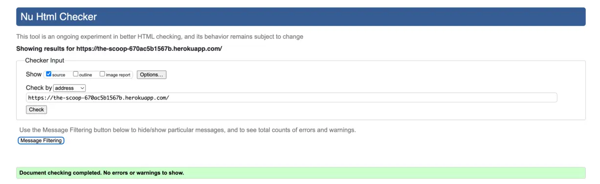

**Login Page**  
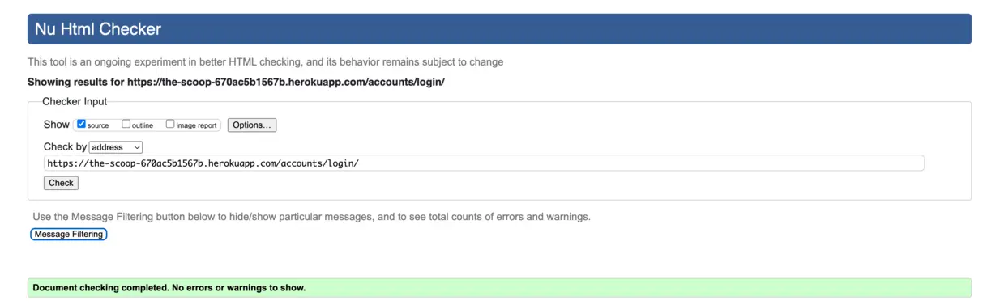

**Logout Page**  
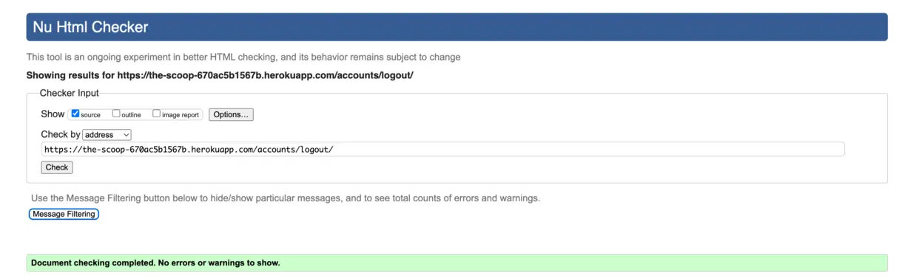

**Review Post Page**  
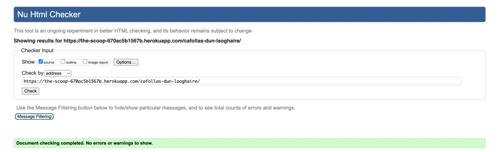

**About Page**  
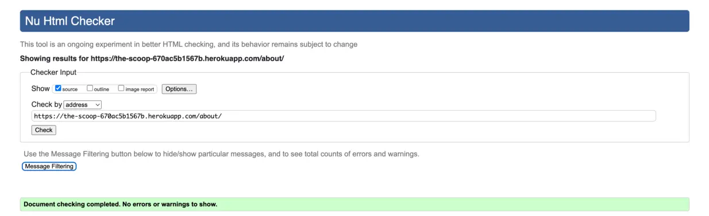

### CSS Validation Corrected

[x] CSS validation all passed.

**Home page**  

**Login Page**  

**Signup Page**  
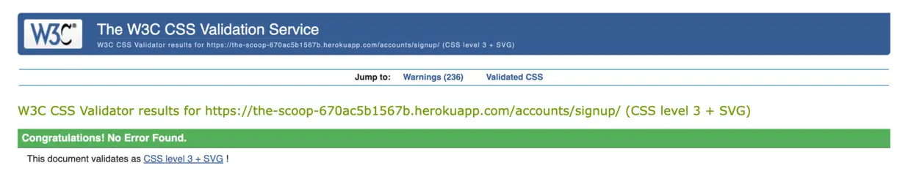

**Logout Page**  
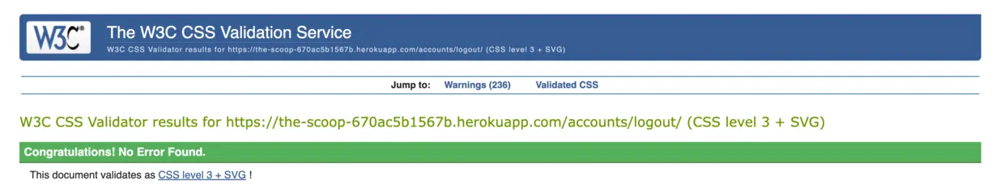

**Review Post Page**  
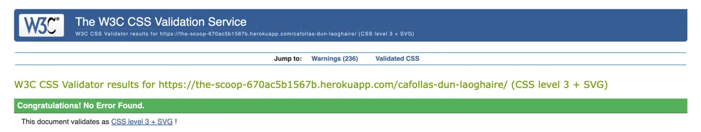

**About Page**  
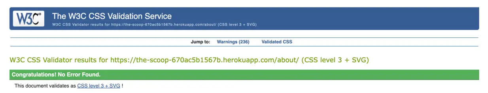

### JSHint

[x] JavaScript tests all passed.

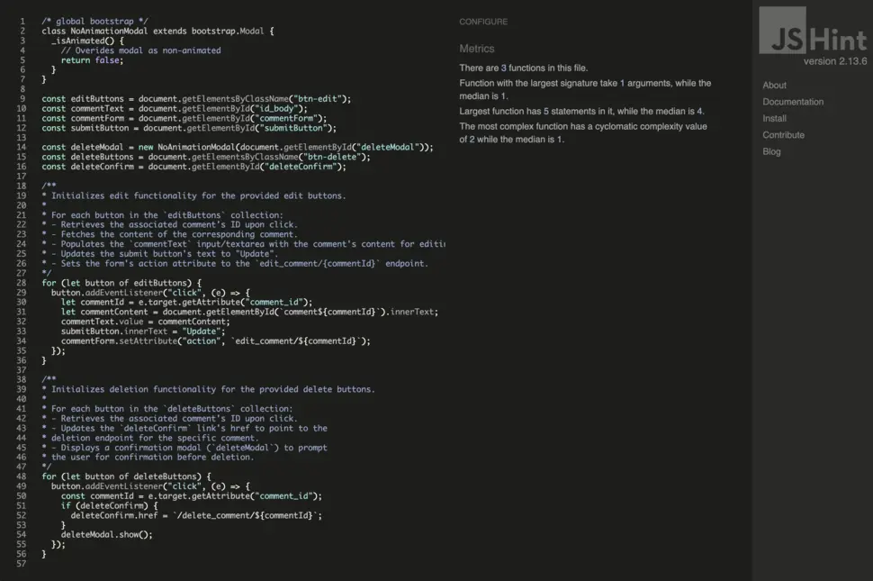

### CI Python Linter

[x] Python tests all passed.

    All Python files containing the project's code have been tested. 
    All the errors were fixed, and after running the CI Python Linter, it shows there are no errors.

| Feature | admin.py | forms.py | models.py | urls.py | views.py | test_views.py | test_forms.py | tests.py |
|---------|:--------:|:--------:|:---------:|:-------:|:--------:|:-------------:|:-------------:|:--------:|
| TheScoop main app | na | na | na | [no errors](static/documentation/testing/main-urls.webp) | na | na | na | na |
| Reviews | [no errors](static/documentation/testing/reviews-admin.webp) | [no errors](static/documentation/testing/reviews-forms.webp) | [no errors](static/documentation/testing/reviews-models.webp) | [no errors](static/documentation/testing/reviews-urls.webp) | [no errors](static/documentation/testing/reviews-views.webp) | [no errors](static/documentation/testing/reviews-test-views.webp) | [no errors](static/documentation/testing/reviews-test-forms.webp) | [no errors](static/documentation/testing/reviews-tests.webp) |
| About  | [no errors](static/documentation/testing/about-admin.webp) | [no errors](static/documentation/testing/about-forms.webp) | [no errors](static/documentation/testing/about-models.webp) | [no errors](static/documentation/testing/about-urls.webp) | [no errors](static/documentation/testing/about-views.webp) | [no errors](static/documentation/testing/about-test-views.webp) | [no errors](static/documentation/testing/about-test-forms.webp) | [no errors](static/documentation/testing/about-tests.webp) |

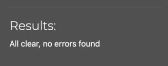

    NOTE: `settings.py` Stock Django code gives E501 error, left unchanged to keep app from breaking.

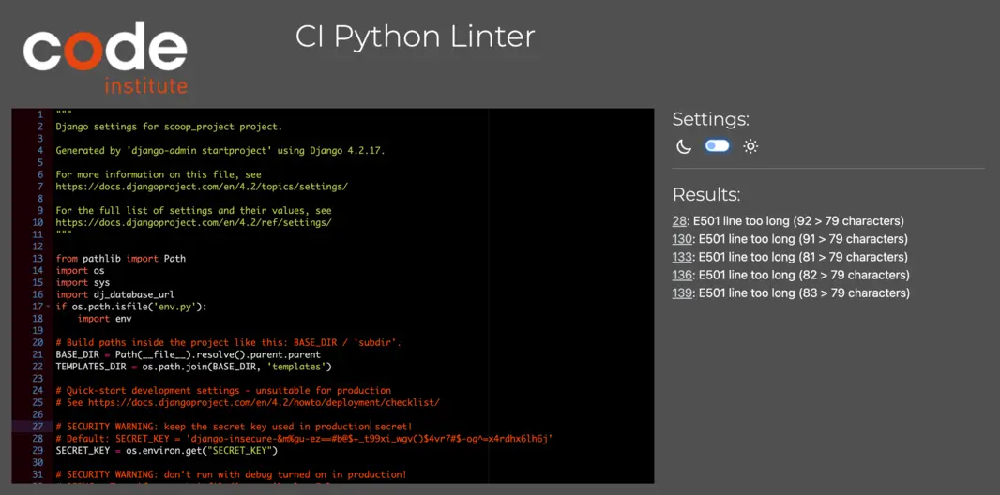

## Lighthouse Test

- [x] Desktop view:

    **Home**  
    

    **Review post page**  
    

    **About Page**  
    

    **Register Page**  
    

    **Login Page**  
    

    **Logout Page**  
    

- [x] Mobile view:
    - Performance was lower than preferred on mobile view due to the site being image heavy on landing page. Images used in the sites design were compressed to offer the best chance for a decent performance score, but the score is significantly lower on 'best practices' - this is due to Cloudinary sending cookies when pulling images. The CDNs used for Bootstrap were also noted in the Lighthouse report as causing issue with performance. This report will be reviewed for future development of The Scoop to raise this score.

    **Home**  
    

### Accessibility

Accessibility was included in every planning stage for The Scoop, through the use of the WAVE report tool I could ensure that any necessary changes were made to make the website as accessible as it could be.

- A minor contrast issue with logo brand on header, pagination buttons and ratings rendered too light for the feature theme and were adjusted accordingly while still keeping to original colour scheme.

    

- After adjusting styles hex colours via [Webaim Contrats Checker](https://webaim.org/resources/contrastchecker/), all errors were resolved successfully.

      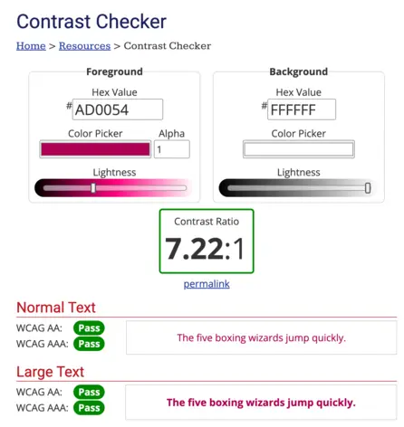

## Manual Testing

### User Input / Form Validation

Testing was carried out on desktop using a Chrome browser to ensure all forms take the intended input and process the input appropriately.
Manual testeing by checking the following:

| TEST INPUT | CORRECT OUTCOME | MEET REQUIREMENTS |
|------------|:---------------:|-------------------|
| **Navbar Logo and Icons** | PASS | Logo takes user to home page, nav bar links take user to intended location, highlight mouse over for better accessibility. Nav bar toggle opens and closes in mobile view | 
| **Log In Status** | PASS | 'You are not logged in' displays in Nav Bar |
| **Login Link** | PASS | Opens Login page |
| **Log into Account** | PASS | Username & password fields. Fields must be exactly as registered originally in either lowercase/uppercase or mixture. Empty fields deliver prompt to user, email field demands '@' symbols. Login is successful, message to confirm you are logged in. 'Welcome {username}' displays in Nav Bar |
| **Register Link** | PASS | Opens Register page |
| **Register Account** | PASS | Username, email(optional) and password fields. Empty fields deliver prompt to user, email field demands '@' symbols, username/password too similar, password too short, username already in use. Account is registered, message to confirm sign up |
| **Review Card Links** | PASS | Review card link goes to the correct review post page |
| **Comment Box (Logged out user)** | PASS | No comment form available, user is prompted to login via url link in place |
| **Comment Box (Logged in user)** | PASS | Comment form available with comment field & submit button. Blank form submit returns prompt. Comment sent prompts user that comment is awaiting approval. Success message promted to confirm action. |
| **Edit Comment** | PASS | Edit button visible under comment in panel. User can only edit their own comments. When editing the original comment is visible in comment form field for edit. If comment was previously approved, another promt is visible that comment is awaiting approval. Success message promted to confirm action. |
| **Delete Comment** | PASS | Delete button visible under comment in panel. Delete modal pops up onclick, allowing user to cancel/confirm action for better usability. Success message promted to confirm action. |
| **Meet Us Page Link** | PASS | About page loaded |
| **Contact Form** | PASS | Collaboration contact form available to any site visitor with name, email, message fields & send button. Empty fields deliver prompt to user, email field demands '@' symbols. Message sent prompts success message to confirm action. |
| **Social Links** | PASS | External link open in a new windows to correct sites |
| **Logout** | PASS | Redirects to log out confirmation page, and account is logged out message once confirmed. 'You are not logged in' displays in Nav Bar |
| **Error Page Load** | PASS | Redirects user to error page template setup for relevant error type, prompts user back to home page with 'Go Back to Home' button |

## Bugs Encountered 
  
The below are bugs that I spent more time investigating or required the assistance of Tutor Support.
Most of these encountered were learning curves. 

| No. | Bug | Solved | Fix | Solution Credit | Commit no. |
| --- | --- | :----: | --- | --------------- | :--------: |
| 1. | Server error 500 | YES | Create reviews generic view within views.py | [Stack Overflow](https://stackoverflow.com/questions/25013549/django-createview-for-generic-model) | 0aef85e |
| 2. | Server error 500 | YES | URL path updated to `reviews/review_list.html` | Innitial incorrect input | 2f178f |
| 3. | Console error while migrating | YES | Temporarily modified slug field to allow null value for migration to process `slug = models.SlugField(max_length=100, unique=True, null=True)` | [Stack Overflow](https://stackoverflow.com/questions/66784564/django-you-are-trying-to-add-a-non-nullable-field-slug-to-post-without-a-defa) | d315a51 |
| 4. | JSON data not loading on first command | YES | Used a primary key for `critic` field, not a string. Extended `blurb` field max-length to 100 in model | Innitial incorrect input | abd3327 |
| 5. | Reviews not loading when running server from terminal | YES | Updated posted reviews column to `scoopreview_list` and Added previous page number into html template. | Innitial incorrect input | 7327706 |
| 6. | Fonts loading error in dev tool, while testing static directory | YES | Tested static directory with script.js and linked fonts.googleapis.com to base.html | [Stack Overflow](https://stackoverflow.com/questions/70170086/why-the-google-fonts-are-not-working-in-my-html-file) | eb2db7f |
| 7. | Review content not previewing on `post_detail.html` | YES | Fix template reference in `views.py`. Correctly reference template by renaming context object(model), see fix `post_detail` object model in views commit (Commit no. 06bbdbd) | Innitial incorrect input | ad4cbf0 |
| 7. | Heroku not deploying latest changes | YES | Running `python manage.py collectstatic` to console, see fix (Commit no. 36e5e18) | Innitial error of not collecting static files after update | fbe7265 |
| 8. | Initial error when running server `AttributeError: module 'reviews.views' has no attribute 'comment_edit'` | YES | Added edit view to comments, `comment_edit` function was placed incorrectly and defined within `post_detail`. Changed indentation allowed function to be correctly accessed by URL pattern. | [Stack Overflow](https://stackoverflow.com/questions/45807594/django-attributeerror-module-user-views-has-no-attribute-user) | 879e7ab |
| 9. | Comment URL not allowing edit when Site User logged in | YES | Create the edit comment URL, see fix (Commit no. 879e7ab8) | [MND Web Docs](https://developer.mozilla.org/en-US/docs/Web/API/EventTarget/addEventListener) | f6ae5b6 |
| 10. | Form field not resetting after submit | YES | Redirect response moved into `else:` block to clear form & avoid resubmitting POST data | [Django Docs](https://docs.djangoproject.com/en/5.1/ref/request-response/#django.http.HttpResponseRedirect) | ab842fd |
| 11. | Contact form allowing blank form submissions | YES | Modified comment field to `required=True`. Field is still optional but blank form cannot be submitted, see (Commit no. 8e60370) | [Django Docs](https://docs.djangoproject.com/en/5.1/ref/forms/api/#django.forms.Form.is_valid)| 30fd047 |
| 12. | Cloudinary stored images not previewing | YES | Fix reviews `featured_image` template tag, if DTL loop corrected to `` and conditional statement working correctly to render variable image vs default | Innitial incorrect input | baee04d |
| 13. | Error 500 after deploy on `post_detail` page views | YES | Removed upvotes downvotes feature from reviews model and views | Initially wanted to return to this, but feature will be added on next update | 75d5e98 |
| 14. | If no directions URL linked to a map, prompts page not found error | YES | Fix error with a conditional statement for `review.directions` and add non breaking space `&nbsp;` as a placeholder when no URL is provided. Directions text link only renders when URL is provided, avoiding page error | [Geeks for Geeks](https://www.geeksforgeeks.org/how-to-add-a-non-breaking-space-using-nbsp-in-html/) | 6beab79 |
| 15. | Mixed content warning when inspecting deployed page `The page at '<URL>' was loaded over HTTPS, but requested an insecure element '<URL>'. This request was automatically upgraded to HTTPS.` | YES | Added a meta tag to base template '<meta http-equiv="Content-Security-Policy" content="upgrade-insecure-requests">', declaring a content security policy, to help control the sources of content loaded on the page. | [MND Web Docs](https://developer.mozilla.org/en-US/docs/Web/HTTP/CSP) | 978d547 |
| 16. | Uncaught error when inspecting deployed page `_isAnimated() { return this._element.classList.contains(CLASS_NAME_FADE) }` | YES | Needed to override default behaviour and modified modal as NoAnimationModal | [Get Bootstrap](https://getbootstrap.com/docs/4.3/components/modal/#remove-animation) | 57155b5 |
| 17. | Error when inspecting delete modal on deployed page `Uncaught TypeError: Cannot set properties of null (setting 'href') at HTMLAnchorElement.<anonymous>` | YES | Corrected event listener, to make sure element exists | Innitial incorrect input | c879c6e |
| 18. | Last minute error with re-check of signup page in html validator `End tag 
 implied, but there were open elements. Unclosed element ` | NO | Bug was created within django-alluth v0.56 and above, as auto generated code. This will be corrected in next version with updates made. | Tutor Support for picking up that bug was made in v0.56 and above, and upon completetion, The Scoop site is using v0.57 | 2316f28 |

### Unfixed Bugs

- One unfixed bug, app running with no further errors.
    - Django-alluth package will need to be downgraded to v0.54, but that would require some adjustment of settings.py file and in some cases downloading templates again. 
    - This will be corrected in next version with updates made.

    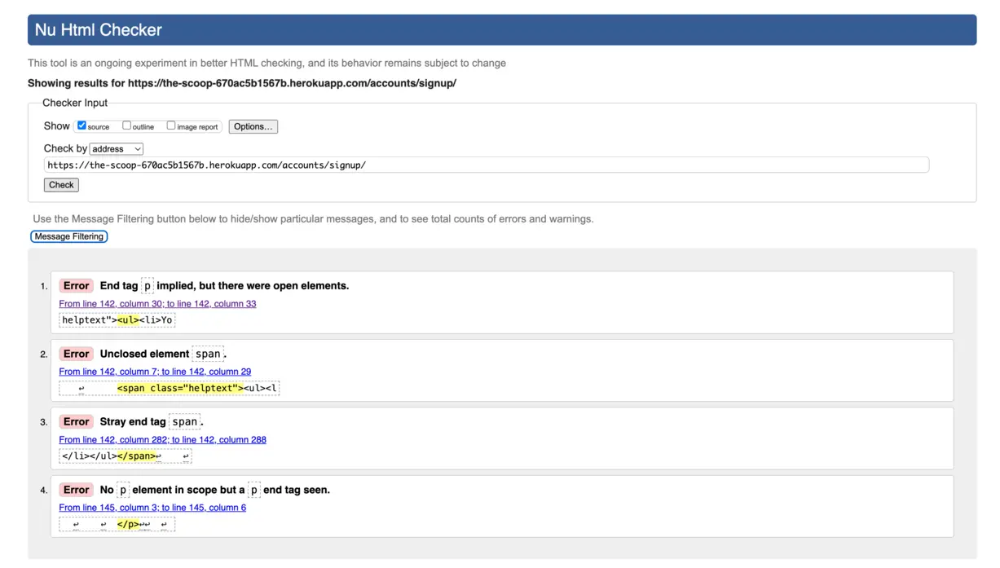

- A warning encountered when refreshing page in Chrome every now and then, disappears in some instances: 
    - `Chrome is moving towards a new experience that allows users to choose to browse without third-party cookies.`
    - This could be due to Cloudinary sending cookies when pulling images, and will be looking further into this on next update.
    - Article about the warning: https://forums.knack.com/t/reading-cookie-in-cross-site-context-will-be-blocked-in-future-chrome-versions/17689

        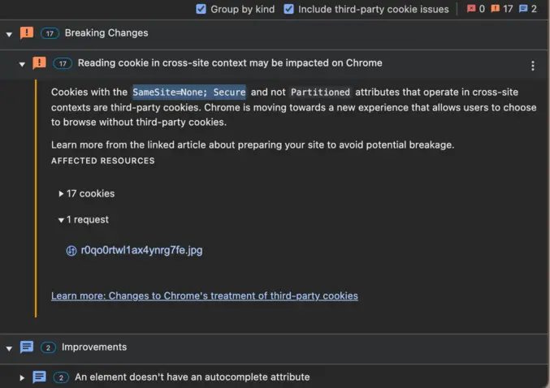